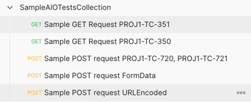
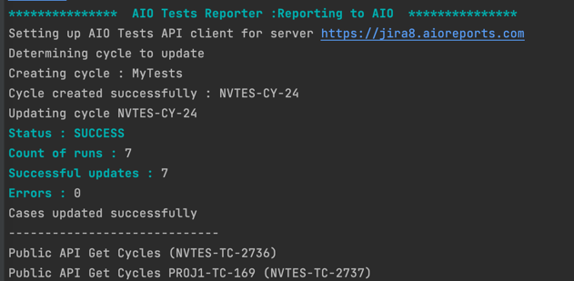
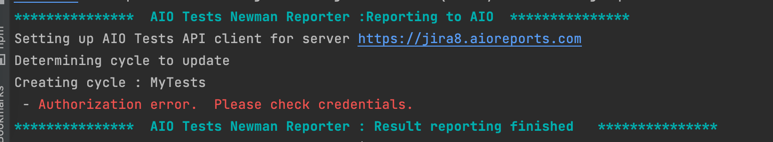

# AIO Tests for Jira Newman Reporter
[AIO Tests for Jira](https://marketplace.atlassian.com/apps/1222843/aio-tests-for-jira) is a Jira-native test management app covering the entire QA lifecycle with Test Cases, Cycles, Reports, Automation, Dashboards, providing a one stop shop for all your testing needs.

With it's Newman reporter, AIO Tests simplifies reporting of results from the automated Postman tests to AIO Tests for Jira.

# How does the AIO Tests Reporter work
By using Newman's event emitters, the AIO Tests Newman Reporter reports results in the ` beforeDone` event, at the end of a collection run.
<br>The reporter can create a new cycle for the executions or reuse existing cycles, based on the configuration done either via command line options or through the reporter config when using newman programmatically.

# How to get started?
```
npm install newman-reporter-aiotests
```

# Use
### Creating and Mapping Postman tests in AIO Tests

#### Creation of Cases
The first time the results are reported, if AIO Tests case keys have not been mapped, then new cases are created.

**Field mapping (Postman → AIO Tests)**

Refer [Field Mapping](https://aioreports.atlassian.net/wiki/spaces/ATDoc/pages/1875116033/Postman+via+Newman+report#Field-mapping-(Postman-%E2%86%92-AIO-Tests)) to see how the fields of Postman request are translated into a new case in AIO Tests

#### Mapping of Cases
The AIO Tests Case key can be added to the name of the API.  <br> If there are multiple case keys in a single description, then the result of one test will be updated to multiple cases.

> &#10002; **Please note that the case key can appear anywhere in the name**

The image below shows case keys in names of requests.  For APIs, where no key is specified, a new case will be created.
The newly created case will be identified using automation key.



### Configure

AIO Tests can be configured for both Newman's programmatic as well as CLI runs.  For both options, 
the authorization needs to be set.  For Cloud, the AIO Tests API Token needs to be generated and for Jira Server/DC,
a PAT token is required.  More details on Authorization for both types can be found [here](https://aioreports.atlassian.net/wiki/spaces/ATDoc/pages/1499594753/Rest+API+Authentication).

#### Newman Programmatic run

Newman can be easily used within your JavaScript projects as a Node.js module. 
The entire set of Newman CLI functionality is available for programmatic use as well.  If running Newman programmatically,
the AIO Tests config can be set as below:
```
var newman = require('newman');

newman.run({
   collection: '/path/to/collection.json',
   reporters: 'aiotests',
   reporter: {
     aiotests: {
        //enableReporting controls, if for this run, results have to be reported or not
        'enableReporting': true, 
        
        // Jira Project Key
        'jiraProjectId': 'PROJ1', 
        
        // Uncooment below : Jira Server URL and Jira PAT is required if on Jira Server/DC
        // 'jiraServer': 'https://jira8.aioreports.com', 
        // 'jiraPat': '<PATToken>', 
        
        //AIO Tests API Key
        'aioApiToken': '<AIO API Key>',
        
        //createNewCycle - defaults to true, Set to true if new cycle needs to be created
        'createNewCycle': false, 
        
        //newCycleTitle - defaults to collection name, if createNewCycle true, newCyclePrefix would be used to create new cycle, else cycleKey would be used to update existing cycle
        'newCycleTitle': '',
        
        //cycleKey - if createNewCycle is false, then set cycleKey to report to existing cycle
        'cycleKey': 'NVTES-CY-403',
        
        //createNewRun - defaults to false, set to true to create new run for each execution
        'createNewRun': true, 
        
        //createCase - defaults to true, Set to false, if new cases should not be created for requests with no cake key mapped
        'createCase': true, 
        
        //bddForceUpdateCase - defaults to true, updates step changes in AIO Case with changes in request data
        'bddForceUpdateCase': true 
                
        //updateOnlyRunStatus - defaults to false, if checked, step matching is skipped and only run status is updated.
        'updateOnlyRunStatus': true 
                        
        //folderHierarchy - Target folder for new test cases. Supports comma-separated folder hierarchy.
        'folderHierarchy': 'Smoke,Basics'    
     }
   }
});
```

Depending on the Jira hosting, the authentication information needs to be provided as below.

#### Newman Command Line

If Newman is being run from the command line, then use the reporter with the -r option.
Specify `-r aiotests` to use the AIO Tests Reporter.  The rest of the configuration option can go as 
`--reporter-aiotests-optionName optionValue` as below:
Please refer to the Programmatic section below to understand the usage of each option.

```
newman run /path/to/collection.json -r aiotests 
    --reporter-aiotests-enableReporting true
    --reporter-aiotests-jiraProjectId 'PROJ1'
    --reporter-aiotests-aioApiToken 'youapitoken'
    --reporter-aiotests-jiraServer 'youapitoken'
    --reporter-aiotests-jiraPat '<jiraPatToken>'
    --reporter-aiotests-createNewCycle 'true'
    --reporter-aiotests-newCycleTitle 'Daily API Smoke'
    --reporter-aiotests-cycleKey 'PROJ1-CY-221'
    --reporter-aiotests-createNewRun 'true'
    --reporter-aiotests-createCase 'true'
    --reporter-aiotests-bddForceUpdateCase 'true'
    --reporter-aiotests-updateOnlyRunStatus 'true'
    --reporter-aiotests-folderHierarchy 'Smoke,Basics'
    
```

# Logging

AIO Tests Newman Reporter logs can be seen in the run logs as below for successful updates



Errors received while updating will appear in a similar way




# Queries/Suggestions?

For any queries, suggestions or issues, please feel free to reach out @ help@aioreports.com

[AIO Tests Overview](https://aioreports.atlassian.net/wiki/spaces/ATDoc/pages/348619753/AIO+Tests+Overview)

[AIO Tests Automation](https://aioreports.atlassian.net/wiki/spaces/ATDoc/pages/390332530/Test+Automation)

